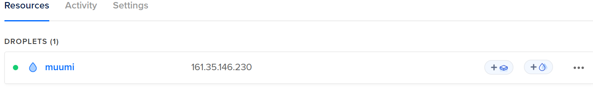

# H4 Maailma Kuulee

## Lue ja tiivistä

*  Tarkoituksena vuokrata haluamalta palveljuntarjoalta oma pilvipalvelin sekä domainnimi
*  Palveluita on monia, koska kilpailu on todella kovaa
*  Palvelinta suojatessa palomuurilla on ensin tärkeää muistaa tehdä "reikä" ssh-palvelimelle
*  Tarpeeksi hyvien ja suojaavien salasanojen käyttö on elintärkeää

### Lähteet 

Teoriasta käytäntöön pilvipalvelimen avulla (h4). Susannalehto.fi.  Luettavissa: https://susannalehto.fi/2022/teoriasta-kaytantoon-pilvipalvelimen-avulla-h4/ 

Karvinen, Tero. 2012. First Steps on a New Virtual Private Server – an Example on DigitalOcean and Ubuntu 16.04 LTS. Luettavissa: https://terokarvinen.com/2017/first-steps-on-a-new-virtual-private-server-an-example-on-digitalocean/ Luettu Helmikuussa 2024

## Pilvipalvelin

Päätin käyttää tehtävässä pilvipalvelun hankkimiseen DigitalOcean palvelua, GitHub Educationin yhdistämällä DigitalOceaniin sai 200 dollaria kredittejä. Rekisteröitymis sekä maksuasioiden hoitamisen jälkeen aloitin varsinaisen virtuaalikoneen (droplet) asennuksen. 

Alue on hyvä valita mahdollisimman läheltä tiedonsiirron nopeuden kannalta joten päädyin valitsemaan datakeskuksen sijainniksi Amsterdamin:

Käyttöjärjestelmäksi valitsin Debianin viimeisimmän version, 12 x64: 

Valitsin paketiksi oletuksena olevan Shared CPU Basic planin, tarjolla oli myös kalliimpia paketteja, mutta tähän tehtävään kyseinen peruspaketti ajaa asiansa mainiosti: 

Autentikointimenetelmäksi valitsin salasanan sekä annoin juuri luodun virtuaalikoneen nimeksi annoin Muumi (geneerinen nimi on hyvä). Pienen odottelun jälkeen asennus oli valmis ja sain samalla myös koneen IP-osoitteen:

## Domain-nimen vuokraus

Vuokrasin domain-nimen Namecheapilta, koska githubin kautta sain .me-päätteisen domainin käyttööni maksutta:

 
